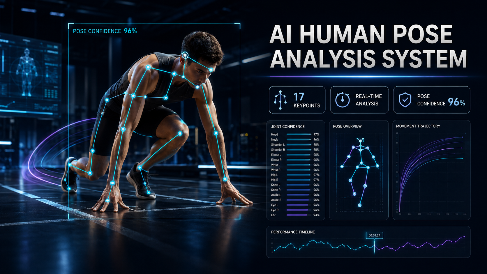
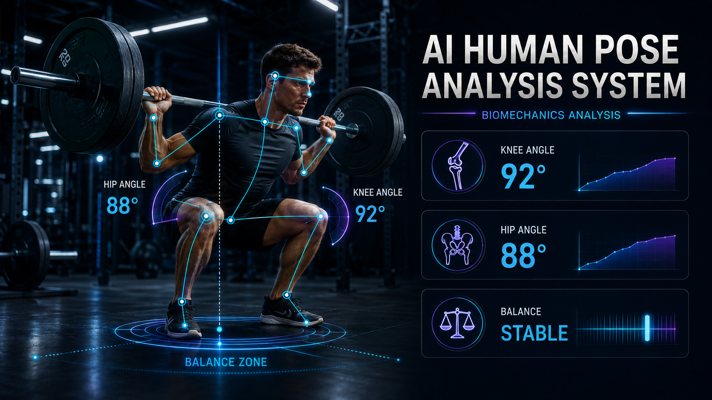
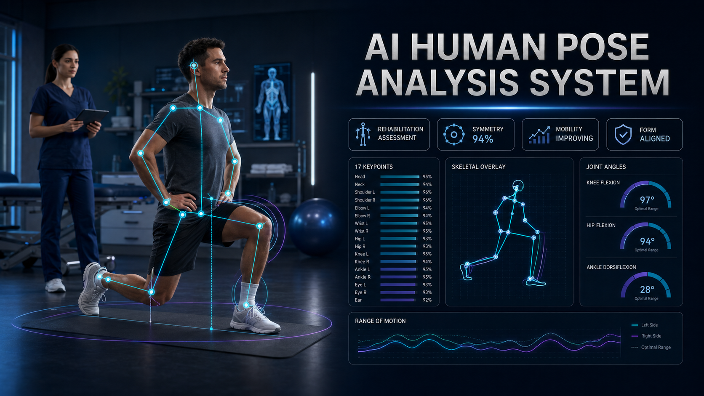
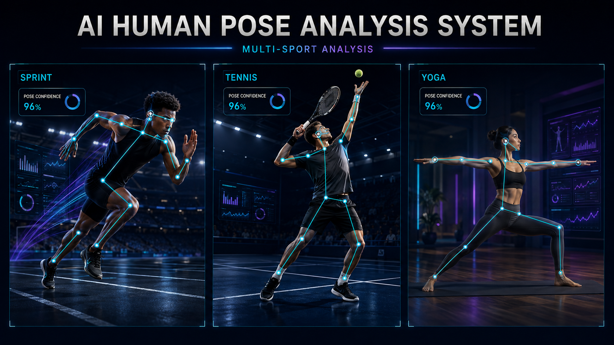
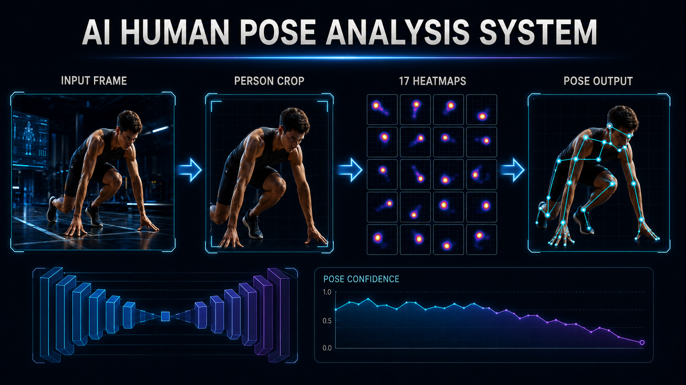

<div align="center">



<br>

# 🧠 AI Human Pose Analysis System

### Intelligent 2D pose estimation from pixels to 17 body keypoints

<p>
  A research-focused computer-vision system that detects a person, predicts COCO body landmarks,<br>
  visualizes joint confidence, and reconstructs an interpretable skeletal pose.
</p>

<p>
  
  
  
  
  
</p>

<p>
  <a href="#-executive-summary">Overview</a> •
  <a href="#-visual-showcase">Showcase</a> •
  <a href="#-system-workflow">Workflow</a> •
  <a href="#-model-architecture">Architecture</a> •
  <a href="#-evaluation-snapshot">Evaluation</a> •
  <a href="#-quick-start">Quick Start</a>
</p>

</div>

---

## 🧭 Executive Summary

**AI Human Pose Analysis System** transforms a monocular RGB image into a structured, 17-joint human skeleton. The workflow automatically identifies the primary subject, produces a centered person crop, estimates one confidence heatmap per COCO landmark, and projects the final keypoints back onto the original image.

The project targets **single-frame, single-person, 2D pose estimation**. Its stacked hourglass network combines full-body context with the spatial precision required for small joints such as wrists, ankles, eyes, and ears.

### 📌 At a Glance

| Category | Project specification |
|---|---|
| 🎯 **Primary task** | Single-person 2D human pose estimation |
| 🖼️ **Input** | Monocular RGB image, normalized to **256 × 256** |
| 🧠 **Core model** | Multi-stack hourglass encoder-decoder with residual blocks |
| 🔥 **Prediction space** | **17** COCO joint-confidence heatmaps at **64 × 64** |
| 🦴 **Output** | Keypoint coordinates, confidence values, and skeleton overlay |
| 📚 **Training data** | COCO 2017 Keypoint Detection dataset |
| 🔍 **Evaluation** | Object Keypoint Similarity (OKS) and PCK@0.2 |
| 🖥️ **Interface** | Interactive Streamlit inference workflow |

---

## ✨ Core Capabilities

| | Capability | What it provides |
|:--:|---|---|
| 🎯 | **Automatic person localization** | Detects and crops the most prominent, center-weighted subject before pose inference |
| 🦴 | **17-keypoint estimation** | Locates facial, upper-body, hip, knee, and ankle landmarks |
| 🔥 | **Heatmap-based prediction** | Preserves spatial uncertainty instead of directly regressing joint coordinates |
| 🧩 | **Iterative pose refinement** | Successive hourglass stacks improve difficult or ambiguous joint predictions |
| 🖌️ | **Skeleton visualization** | Maps predicted landmarks back to the full-resolution source image |
| 🔬 | **Explainable inference** | Exposes intermediate joint heatmaps and per-landmark confidence |
| 📊 | **Quantitative evaluation** | Supports COCO-formatted OKS analysis and PCK-based joint accuracy |
| ⚡ | **Interactive testing** | Accepts demo images or user uploads through a Streamlit interface |

> [!NOTE]
> The HDR visuals in this README are polished application concepts. They demonstrate how this project's pose outputs could support sports science, movement screening, and supervised rehabilitation; they are not literal screenshots of the current Streamlit interface.

---

## 🖼️ Visual Showcase

<table>
  <tr>
    <td width="50%" align="center">
      
      <br>
      <strong>🏋️ Biomechanics Analysis</strong>
      <br>
      <sub>Joint angles, balance zones, and movement-form interpretation.</sub>
    </td>
    <td width="50%" align="center">
      
      <br>
      <strong>🩺 Rehabilitation Assessment</strong>
      <br>
      <sub>Pose symmetry, range of motion, and supervised mobility review.</sub>
    </td>
  </tr>
</table>

### 🏃 Multi-Sport Pose Intelligence



A shared 17-keypoint representation can describe highly varied body configurations across sprinting, racquet sports, and controlled mobility exercises.

---

## ⚙️ System Workflow



| Stage | Operation | Result |
|:--:|---|---|
| **01** | 📥 **Input acquisition** | Load an RGB image containing the subject |
| **02** | 🔎 **Person localization** | Select the most prominent center-weighted person |
| **03** | ✂️ **Crop and preprocess** | Center, resize, and normalize the person crop |
| **04** | 🧠 **Hourglass inference** | Combine global body context with local spatial features |
| **05** | 🔥 **Heatmap prediction** | Produce a confidence surface for each of 17 joints |
| **06** | 📍 **Coordinate extraction** | Upscale, smooth, threshold, and locate heatmap maxima |
| **07** | 🦴 **Pose reconstruction** | Map keypoints to the source image and render the skeleton |

### 🗺️ COCO Keypoint Map

```text
                         nose
                    ┌─────┴─────┐
                 left eye    right eye
                    │              │
                 left ear    right ear

 left shoulder ─── right shoulder
       │                  │
 left elbow          right elbow
       │                  │
 left wrist          right wrist

    left hip ───────── right hip
       │                  │
   left knee          right knee
       │                  │
  left ankle         right ankle
```

---

## 🧠 Model Architecture

The architecture uses symmetric encoder-decoder modules to repeatedly compress and recover spatial information. Lower-resolution layers capture global pose structure, while skip connections retain the detail needed for precise joint localization.

```text
┌──────────────────────────────┐
│      RGB Image 256 × 256     │
└──────────────┬───────────────┘
               ▼
┌──────────────────────────────┐
│ Convolution + Residual Stem  │
└──────────────┬───────────────┘
               ▼
┌──────────────────────────────┐
│      Feature Map 64 × 64     │
└──────────────┬───────────────┘
               ▼
┌──────────────────────────────────────────┐
│          Stacked Hourglass Module        │
│  Encoder → 4 × 4 Bottleneck → Decoder   │
│       + same-resolution skip paths       │
└──────────────┬───────────────────────────┘
               ▼
┌──────────────────────────────┐
│  17 Supervised Joint Maps    │
└──────────────┬───────────────┘
               ▼
┌──────────────────────────────┐
│ Keypoints + Skeleton Overlay │
└──────────────────────────────┘
```

### 💡 Why This Design Works

- **Multi-scale context:** the bottleneck reasons about the full body configuration.
- **Fine spatial recovery:** skip connections restore local joint detail.
- **Residual learning:** alternate gradient paths support deeper optimization.
- **Intermediate supervision:** every stack learns to produce and refine a valid pose.
- **Heatmap confidence:** predictions remain spatially interpretable before coordinate extraction.

---

## 📊 Evaluation Snapshot

The original experiments report the following results:

| Metric | Result | What it measures |
|---|:---:|---|
| **OKS — primary challenge** | **0.575** | COCO-style keypoint similarity under stricter thresholds |
| **OKS — loose threshold** | **0.795** | Keypoint similarity under a more permissive threshold |
| **PCK@0.2** | **0.787** | Joints predicted within the normalized distance threshold |
| **Flip-test improvement** | **≈ 3–5%** | OKS gain from horizontal-flip inference averaging |

### 📈 Performance Profile

**Works best when:**

- the main subject is centered and clearly visible;
- the person fills approximately 70–90% of the frame height;
- left and right limbs are visually separated;
- lighting and image sharpness are sufficient.

**Remains challenging when:**

- multiple people overlap heavily;
- joints are occluded or outside the frame;
- the pose contains extreme articulation;
- motion blur or unusual viewpoints hide local detail.

---

## 🎯 Application Areas

| Domain | Example use |
|---|---|
| 🏃 **Sports analytics** | Technique review, joint-angle estimation, and movement-form comparison |
| 🏋️ **Fitness coaching** | Exercise alignment checks and repetition-stage analysis |
| 🩺 **Rehabilitation research** | Supervised range-of-motion and left-right symmetry assessment |
| 🎬 **Animation and media** | Pose references for character motion and visual effects |
| 🛡️ **Safety research** | Body-state and posture cues for controlled monitoring environments |
| 🤟 **Assistive systems** | Pose features for gesture and sign-language research pipelines |

---

## 🚀 Quick Start

### 1️⃣ Clone the Repository

```bash
git clone https://github.com/AsadAliEng/AI-Human-Pose-Analysis-System.git
cd AI-Human-Pose-Analysis-System
git submodule update --init --recursive
```

### 2️⃣ Create a Virtual Environment

<details open>
<summary><strong>🪟 Windows PowerShell</strong></summary>

```powershell
python -m venv .venv
.\.venv\Scripts\Activate.ps1
python -m pip install --upgrade pip
pip install -r requirements.txt
```

</details>

<details>
<summary><strong>🐧 Linux / macOS</strong></summary>

```bash
python3 -m venv .venv
source .venv/bin/activate
python -m pip install --upgrade pip
pip install -r requirements.txt
```

</details>

### 3️⃣ Launch the Application

```bash
streamlit run human_pose_app.py
```

### 4️⃣ Run Inference

1. Upload an image containing a clearly visible person.
2. Keep automatic person detection enabled for uncropped images.
3. Review the detected subject and normalized crop.
4. Inspect the predicted keypoints, confidence heatmaps, and skeleton.
5. If localization fails, crop the subject manually and retry.

---

## 🧪 Training with COCO 2017

<details>
<summary><strong>Open dataset and training setup</strong></summary>

### 📦 Install the Optional Augmentation Dependency

`imgaug` is required for training-time augmentation, not normal inference.

```bash
pip install "setuptools<81"
pip install --no-build-isolation "imgaug @ git+https://github.com/jasoncmyers/imgaug.git"
```

### ⬇️ Download the Dataset

```bash
bash ./scripts/coco_dl.sh
```

### 💾 Storage Planning

| Stage | Approximate space |
|---|---:|
| Compressed training archive | **18 GB** |
| Extracted dataset | **30 GB** |
| Recommended free space during setup | **45+ GB** |

During preprocessing, annotations with fewer than five visible keypoints are filtered. Multi-person images are converted into centered single-person crops, and every visible landmark is represented as a Gaussian heatmap.

</details>

---

## 🔬 Technical Deep Dive

<details>
<summary><strong>Why use heatmaps instead of direct coordinate regression?</strong></summary>

Direct coordinate regression requires the model to learn a highly nonlinear mapping from every image pixel to exact joint positions. Heatmaps retain local spatial uncertainty, allowing the network to represent a likely region before selecting the final maximum.

</details>

<details>
<summary><strong>Why use stacked hourglass modules?</strong></summary>

Human pose estimation needs global context and local precision at the same time. Each hourglass compresses features to reason about the full body, then restores resolution while combining encoder detail through skip connections.

</details>

<details>
<summary><strong>Why apply intermediate supervision?</strong></summary>

Each hourglass stack emits a pose estimate and receives its own training signal. This improves gradient flow, reduces optimization difficulty, and encourages later stacks to refine ambiguous left/right or partially occluded joints.

</details>

---

## ⚠️ Limitations & Responsible Use

- The inference workflow is primarily designed for **one person per crop**.
- In a multi-person frame, the most prominent center-weighted subject is selected.
- Accuracy may fall under occlusion, blur, unusual viewpoints, or overlapping limbs.
- Results depend on how closely input imagery resembles the COCO training distribution.
- Production sports or healthcare use requires temporal tracking, camera calibration, domain-specific validation, and human review.
- This project is a research and educational system—not a medical diagnostic device.

---

## 📚 Project Background & References

This project builds on the open-source [COCO Human Pose](https://github.com/robertklee/COCO-Human-Pose) implementation and the stacked hourglass approach for human pose estimation. The redesigned documentation preserves that technical foundation while presenting the work as a structured computer-vision case study.

- 📄 [Stacked Hourglass Networks for Human Pose Estimation](https://arxiv.org/abs/1603.06937)
- 🗂️ [COCO 2017 Keypoints Dataset](https://cocodataset.org/#keypoints-2017)
- 🖥️ [Streamlit Documentation](https://docs.streamlit.io/)
- 👁️ [OpenCV Documentation](https://docs.opencv.org/)

---

## 👨‍💻 Developer & Maintainer

<div align="center">

<a href="https://github.com/AsadAliEng">
  
</a>

### Asad Ali

**Developer · Repository Maintainer**

<p>
  <a href="https://github.com/AsadAliEng">
    
  </a>
  <a href="mailto:asadali.cryptoeng@gmail.com">
    
  </a>
</p>

| Detail | Information |
|---|---|
| 👤 **Name** | Asad Ali |
| 💻 **GitHub** | [@AsadAliEng](https://github.com/AsadAliEng) |
| 📧 **Email** | [asadali.cryptoeng@gmail.com](mailto:asadali.cryptoeng@gmail.com) |

<sub>Open to technical discussions, collaboration, and computer-vision research.</sub>

</div>

---

<div align="center">

## ⭐ AI Human Pose Analysis System

**Detect • Localize • Understand Movement**

Built for explainable pose estimation, computer-vision research, and responsible movement analysis.

<sub>If this project helps your research, consider starring the repository.</sub>

</div>
